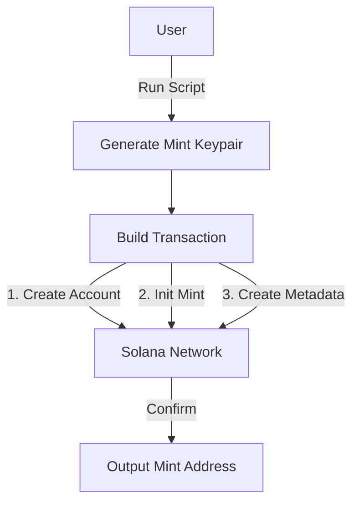
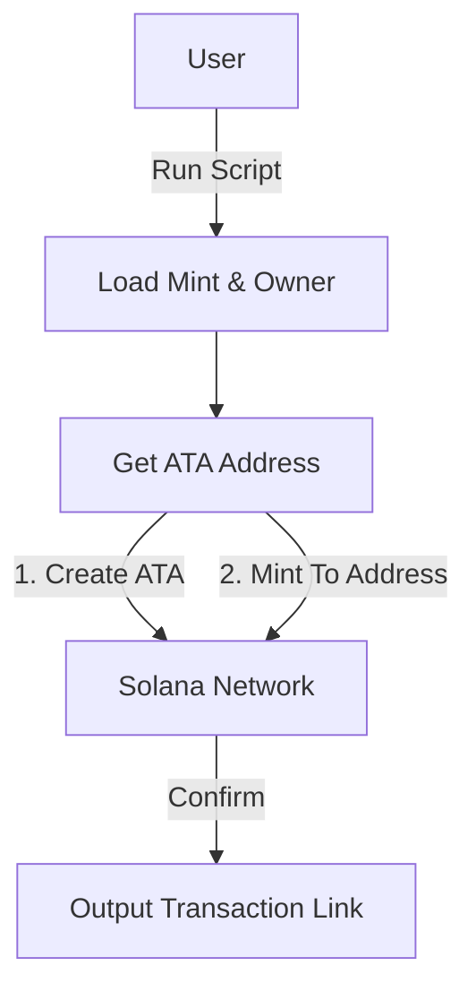

# SPL Token Creation/ Minting tokens  


**Liku Token (LKU)**

A uniform SPL Token deployed on Solana Devnet.

- **Symbol**: LKU
- **Decimals**: 9
- **Network**: Devnet

Explorer: https://explorer.solana.com/tx/2T85bs8xta1GWJ33gLEoJ4EDiVKNkFDniPxCznn7a5BWDaAvDYQgLGSSFgjTfFBn32Qw1UGsEbTvirkJuc9678gz?cluster=devnet

## Overview
Scripts for creating and minting Solana tokens using the Gill SDK.

## Structure

- `Token-creation-metadata/`
  Creates a new SPL Token Mint and its metadata on Devnet.

- `mint-token/`
  Mints tokens to a specific wallet address.

## Token Creation Diagram



## Minting Process Diagram



## Usage

### 1. Create New Token
```bash
npx tsx Token-creation-metadata/src/index.ts
```

### 2. Mint Tokens
Edit `mint-token/src/mint-token.ts` with your Mint Address and Amount.
```bash
npx tsx mint-token/src/mint-token.ts
```
